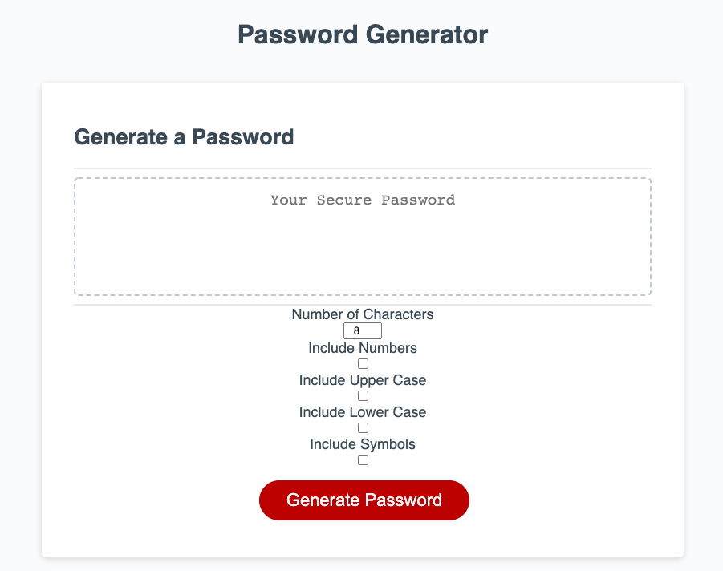
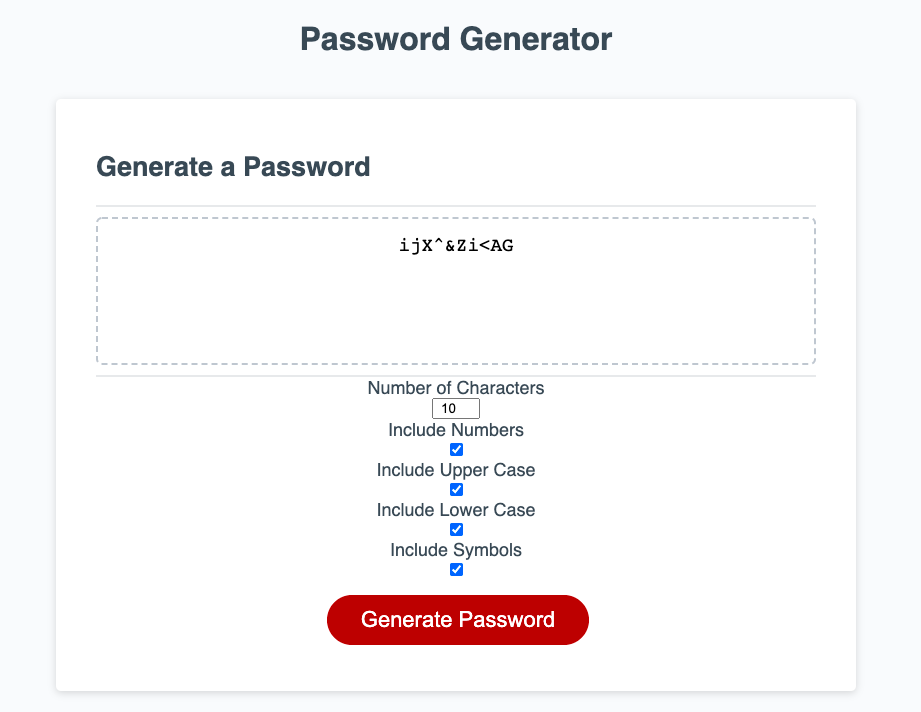
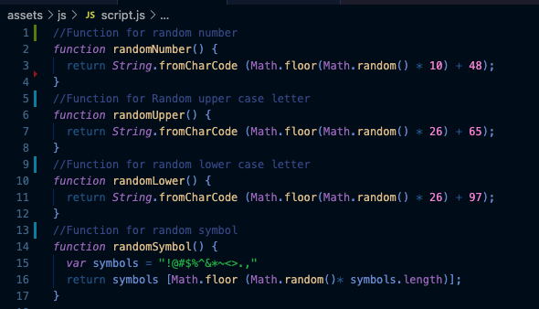

# Password-Generator

## Description
The purpose of this project was to create a password-generator where users could customize their password based on the following criteria:
* Number of characters
* Whether or not to include numbers
* Whether or not to include symbols
* Whether or not to include upper case letters
* Whether or not to include lower case letters

To start I was given some starter code which included all the html, css and some javascript. I added an input box for the user to enter their desired number of characters into, along with check boxes for the other criteria listed above to the html. For the javascript portion I added random generator functions, some if statements to correspond with my my above criteria and some for loops to select the characters needed from my functions. 
---
## Demo
 

---
## Challenges and Resources
One of the things I found most challenging about this project was creating functions that randomly generated upper and lower case letters, numbers and symbols. To make this happen I used the following method found in the following video:

 
Reference Video: https://youtu.be/duNmhKgtcsI 
---
## Deployed Website
https://kirmarnel.github.io/Password-Generator/ 